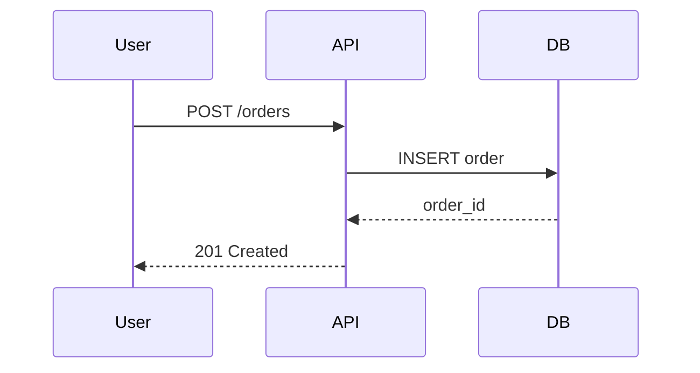
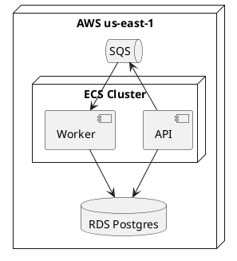
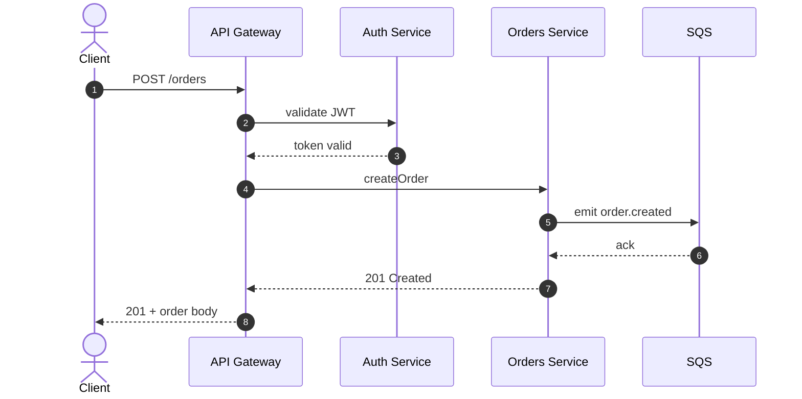
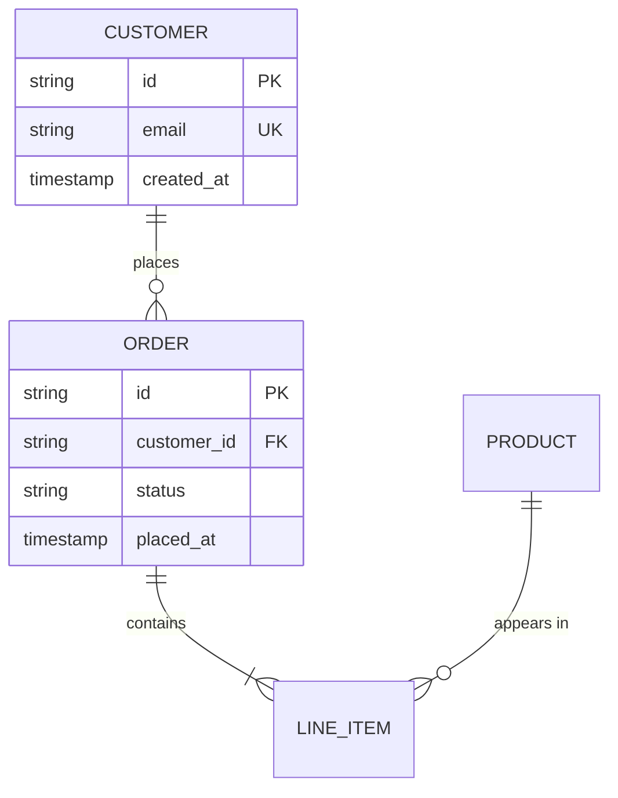

# D2 / Mermaid / PlantUML / Structurizr — Diagrams

Diagrams in docs should be text-as-code so they version in git, diff cleanly, and don't depend on a designer. The 2026 stack:

| Tool | Use when |
|---|---|
| **Mermaid** | GitHub-native rendering matters; flowcharts, sequence, state, ER, gantt; quick inline diagrams |
| **D2** | Modern look-and-feel matters; large architecture diagrams; auto-layout quality matters |
| **PlantUML** | Full UML completeness required (deployment, component, activity); legacy projects |
| **Structurizr DSL** | C4 model (Context / Container / Component / Code) architecture |

## When to use this skill

- Adding diagrams to README, tutorial, or ADR.
- Visualizing architecture in an explanation guide.
- Documenting a sequence flow or state machine in a reference page.

## Mermaid (default for inline markdown)

### Install (for non-GitHub rendering)

```bash
npm i -g @mermaid-js/mermaid-cli
mmdc --version
```

GitHub renders Mermaid in markdown natively — no install needed when shipping to GitHub.

### Inline in markdown

````markdown

````

### Render to SVG/PNG (CI / sites that don't natively render Mermaid)

```bash
mmdc -i diagram.mmd -o diagram.svg -t dark -b transparent
mmdc -i diagram.mmd -o diagram.png -t default -w 1600 -H 900 --backgroundColor white
```

### Mermaid catalog

| Type | Use |
|---|---|
| `graph` / `flowchart` | decision trees, process flows |
| `sequenceDiagram` | API call sequences |
| `classDiagram` | object models |
| `stateDiagram-v2` | lifecycles, state machines |
| `erDiagram` | database schemas |
| `gantt` | project timelines |
| `pie` | proportions |
| `gitGraph` | branch strategies |
| `journey` | user journeys |
| `mindmap` | brainstorms, topic maps |
| `timeline` | project / product timelines |
| `quadrantChart` | 2x2 prioritization grids |
| `sankey-beta` | flow / volume diagrams |
| `block-beta` | block layouts |

## D2 (default for architecture)

### Install

```bash
# unix-like
curl -fsSL https://d2lang.com/install.sh | sh -s --
# brew
brew install d2
d2 --version
```

### Author + render

`architecture.d2`:

```d2
title: Acme API — Production

users -> cloudfront: HTTPS
cloudfront -> alb
alb -> api {
  shape: rectangle
  style.fill: "#3b82f6"
}
api -> postgres: SQL
api -> redis: cache
api -> sqs: events

sqs -> worker {
  shape: rectangle
  style.stroke: "#ef4444"
}
worker -> postgres

postgres: {
  shape: cylinder
  label: "PostgreSQL 15"
}

# Group
backend: {
  api
  worker
  postgres
  redis
  sqs
}
```

Render:

```bash
d2 architecture.d2 architecture.svg              # default theme
d2 -t 200 architecture.d2 architecture.svg       # theme 200 = origami
d2 --layout=elk architecture.d2 out.svg          # ELK layout (better for large graphs)
d2 -w architecture.d2 architecture.svg           # watch mode
```

### D2 themes (all built-in)

```bash
d2 themes        # list
# popular themes:
d2 -t 0   in.d2 out.svg     # neutral default
d2 -t 200 in.d2 out.svg     # origami (clean lines)
d2 -t 300 in.d2 out.svg     # shirley temple
d2 -t 8   in.d2 out.svg     # earth tones
d2 --dark-theme 200 in.d2 out.svg
```

## PlantUML (UML completeness)

### Install

```bash
brew install plantuml graphviz
# or run via Docker
docker run --rm -v "$PWD":/data plantuml/plantuml -tsvg diagram.puml
```

### Author

`deployment.puml`:



```bash
plantuml -tsvg deployment.puml      # → deployment.svg
```

## Structurizr DSL (C4 model)

### Install

```bash
brew install structurizr-cli
# or
docker run --rm -v "$PWD":/workspace structurizr/cli
```

### Author

`workspace.dsl`:

```
workspace "Acme" {
  model {
    user = person "Developer" "Uses the Acme SDK"
    acme = softwareSystem "Acme Platform" {
      api = container "API" "REST + GraphQL" "Go"
      web = container "Web app" "React" "TypeScript"
      db  = container "Database" "PostgreSQL 15" "RDBMS"
    }
    user -> web "Uses"
    web -> api "Calls" "HTTPS/JSON"
    api -> db "Reads/writes" "SQL"
  }
  views {
    systemContext acme { include * }
    container     acme { include * }
    styles {
      element "Container" { background "#3b82f6" }
    }
  }
}
```

Export:

```bash
structurizr-cli export -workspace workspace.dsl -format mermaid
structurizr-cli export -workspace workspace.dsl -format plantuml
structurizr-cli export -workspace workspace.dsl -format dot
```

Structurizr exports to Mermaid / PlantUML / DOT — pick the downstream renderer.

## Decision rule (concrete)

```
GIVEN a diagram task:
  IF target is GitHub README/Markdown rendered inline → Mermaid
  ELIF target is system architecture > 8 nodes        → D2
  ELIF target needs UML deployment/activity/use-case  → PlantUML
  ELIF target is enterprise C4 architecture           → Structurizr DSL
  ELSE                                                → Mermaid (default)
```

## CI integration

```yaml
# .github/workflows/diagrams.yml
name: Diagrams
on:
  pull_request:
    paths: ['docs/**/*.mmd', 'docs/**/*.d2']
jobs:
  validate:
    runs-on: ubuntu-latest
    steps:
      - uses: actions/checkout@v4
      - run: npm i -g @mermaid-js/mermaid-cli
      - run: curl -fsSL https://d2lang.com/install.sh | sh -s --
      - run: |
          for f in docs/**/*.mmd; do mmdc -i "$f" -o /tmp/$(basename "$f" .mmd).svg || exit 1; done
      - run: |
          for f in docs/**/*.d2;  do d2 "$f" /tmp/$(basename "$f" .d2).svg || exit 1; done
```

## Common recipes

### Recipe 1: Sequence diagram for an API flow (Mermaid)

````markdown

````

### Recipe 2: Architecture diagram (D2)

```d2
direction: right

users -> cdn
cdn -> {
  edge_workers
  origin
}
origin -> {
  api_servers
  static_bucket
}
api_servers -> {
  cache
  primary_db
  read_replica
}
```

### Recipe 3: ER diagram (Mermaid)

````markdown

````

## Edge cases

- **Mermaid large flowcharts:** > 50 nodes start looking cramped; switch to D2.
- **D2 in GitHub markdown:** GitHub doesn't render D2 inline as of 2026; render to SVG and commit the SVG.
- **PlantUML server dependency:** the JAR includes a render engine; no external server needed.
- **Dark-mode diagrams:** Mermaid `%%{init: {'theme':'dark'}}%%` directive; D2 `--dark-theme`; PlantUML `skinparam` block.
- **Accessibility:** every diagram needs alt text describing the diagram for screen readers.

## Sources

- Mermaid: https://mermaid.js.org/
- Mermaid CLI: https://github.com/mermaid-js/mermaid-cli
- D2: https://d2lang.com/
- D2 GitHub: https://github.com/terrastruct/d2
- PlantUML: https://plantuml.com/
- Structurizr: https://structurizr.com/
- C4 model: https://c4model.com/
